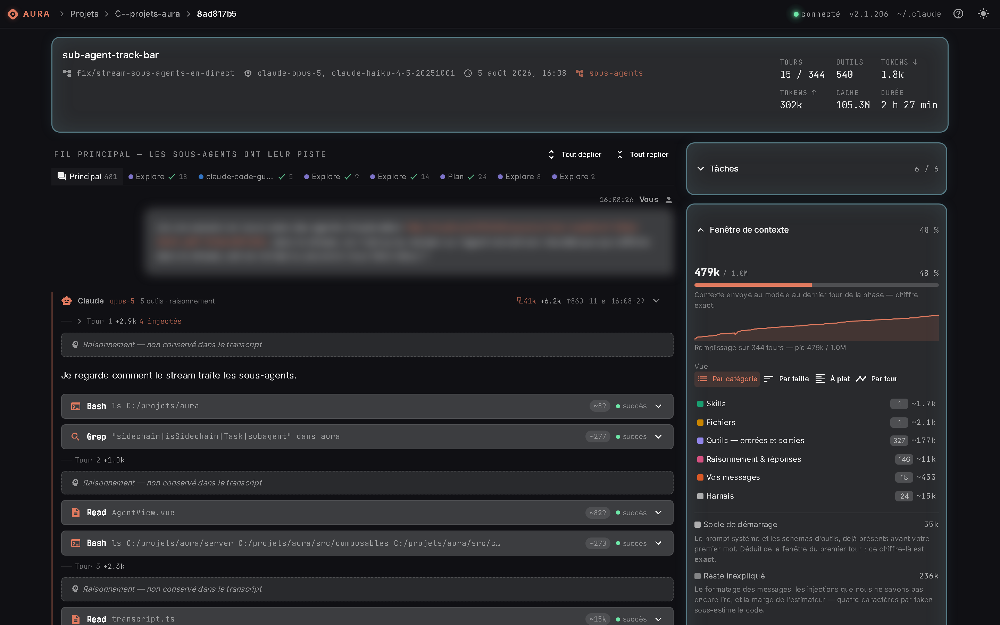
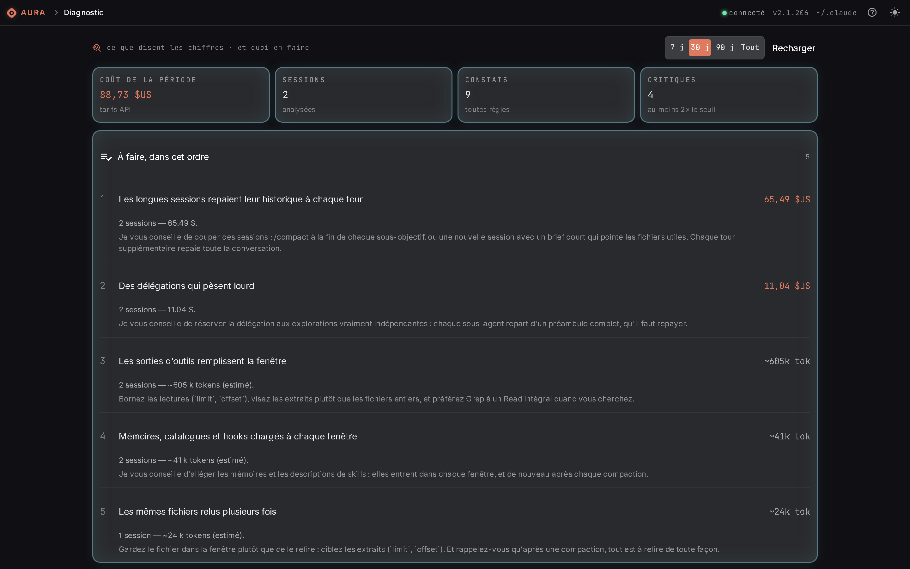
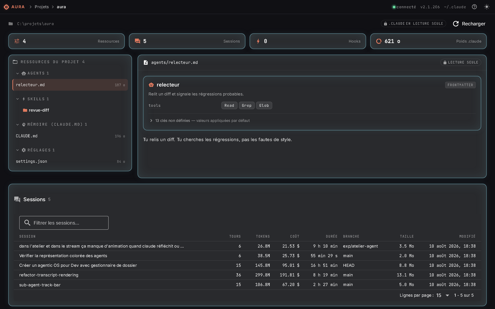

<div align="center">


# AURA

**Agentic Unified Resource Assistant**

_The control desk for your Claude Code environment._

[](https://github.com/Shaenn/aura/actions/workflows/ci.yml)
[](LICENSE)
[](#security--privacy)
[](#requirements)
[](#requirements)
[](#architecture)

**[The site and the manual online](https://shaenn.github.io/aura/en/)**

**English** · [Français](README.md)

</div>

---

Claude Code writes a great deal into `~/.claude`, and shows almost none of it.

Your agents, your skills, your hooks, your MCP servers, your permissions live in a handful of
JSON and Markdown files edited blind. Your sessions, for their part, leave behind `.jsonl`
transcripts of several megabytes — the full account of what the model read, thought, attempted
and spent — that nobody ever reads.

**AURA opens that folder.** It is a local web application that inventories your resources,
watches your sessions live, replays the old ones line by line, prices what they cost, and tells
you which ones deserved an action. It runs on your machine, talks to no outside service, and
never changes a file without showing you the diff first.

This is a personal project, written first of all to understand what happens behind the scenes.
The CLI is sparing: it works well, but it says almost nothing about what it does — and using
Claude Code well is precisely a matter of seeing what goes on under the hood, locally, on your
own files. AURA is the tool I built to look.

```bash
pnpm install && pnpm dev:all
```

<p align="center">
  
</p>

<p align="center">
  
  
</p>

<p align="center"><sub>The screenshots use an anonymised demonstration dataset. The interface is shown in French; it also runs in English.</sub></p>

---

## Not another token counter

There are a good half-dozen dashboards that read your transcripts and tell you what Claude Code
costs you. They do it well. AURA overlaps them on that ground, but that is not where it is
decided.

|                                           | Usage counters | Config managers | **AURA** |
| ----------------------------------------- | :------------: | :-------------: | :------: |
| Tokens, costs, charts                     |      yes       |        —        |   yes    |
| Edit agents, skills, hooks, MCP, settings |       —        |       yes       |   yes    |
| Full replay of a session                  |   sometimes    |        —        |   yes    |
| **Context window rebuilt**                |       —        |        —        | **yes**  |
| **Sub-agent tracks kept separate**        |       —        |        —        | **yes**  |
| **Diagnostic calibrated on your corpus**  |       —        |        —        | **yes**  |
| **Diff + backup before every write**      |       —        |    sometimes    | **yes**  |
| Run a session from the interface          |       —        |        —        |   yes    |

The two left-hand columns describe families of tools, not named projects: the comparison stays
true when one of them adds a feature.

What is left once the “costs” row is set aside: **AURA is the only place where you see what
filled the context window**, what a compaction threw away, what a sub-agent actually did — and
the only one that writes into `~/.claude` under contract.

---

## What AURA does

### Replay a session, and see what filled the context

The replay rebuilds a whole session from its transcript: every turn, every tool call in a view
**specific to that tool** — a diff for an edit, the language server's answer for an `LSP`, the
image first when the tool produced one.

What exists nowhere else:

- **The context window, rebuilt turn by turn.** What filled it, in what order, and **what a
  compaction threw away**. You finally see where the tokens go.
- **The sub-agent tracks.** A two-hundred-turn run inserted where it was called drowns the main
  thread. Here each sub-agent has its own tab, and the URL carries it — it is an address, the
  one you share to show what an agent did.
- **The real cost of the session**, token by token, cache included.

### Watch sessions live

The list of Claude Code sessions running on the machine, with their status: working, **waiting
for you**, or idle. The amber dot of a session blocked on a permission is the useful signal of
the screen.

AURA does not simply read the state files: the CLI only removes them when it exits cleanly, so
AURA **asks the system about every PID** and drops the ghosts. And the refresh is not polling —
the server watches the folder and pushes changes over SSE, with a slow safety net for lost
events.

### Read a project's documentation, not just its `.claude`

A project's page inventories its `.claude` folder, but the substance often sits beside it:

- **Agent instructions**, looked for at any depth because that is how they apply —
  `CLAUDE.md`, but also `AGENTS.md`, `GEMINI.md`, `.cursorrules`,
  `.github/copilot-instructions.md`. The file closest to the code wins.
- **Repository documents** — `README`, `CONTRIBUTING`, `CHANGELOG`, `LICENSE`,
  `ARCHITECTURE`… — taken at the root only: in a monorepo, one `README` per package would make
  a list without end.
- **The folders you include.** A `docs/`, a `specs/`, a folder of reports the AI filled in:
  AURA counts the documents in each folder and offers them, but does not choose — a folder of
  templates the program consumes looks exactly like a folder of documentation. Nothing is
  written into your repository: inclusion is a preference, stored on AURA's side.

That last one opens AURA's only read outside `.claude`, and it is guarded accordingly: the
list is **re-read from disk before every read**, and nothing else is opened. With nothing
included, this door opens nothing.

### Know where the money goes

Two screens, two intents. **Usage** answers “how much, and where”: cost per day, per model, per
project, and the share of sub-agents — whose tokens live in separate files nobody ever counts.

**Diagnostic** answers “is that abnormal, and what do I do about it”. Its method is worth
stating, because it is what separates a report from a quote:

- A threshold is `max(P90 of your corpus, a guardrail)`. The percentile says “unusual **here**”
  — 78% cache is excellent on a corpus at 60%, mediocre on a corpus at 99%. The guardrail adds
  “and big enough to be worth an action”.
- A guardrail **can only silence**. At worst it hides a real but minor problem; it never invents
  one.
- Actions are ranked by **cumulative impact, not by severity**: a minor rule on fifty sessions
  comes before a critical rule on two, because the sum is what decides what you do on Monday.
- Every figure states whether it is **measured or estimated**, with its basis.
- The report ends with **“what it doesn't know”**: uncalibrated thresholds, models with no known
  rate, share of the window actually attributed.

> Amounts are computed at **API list rates**. A Pro or Max plan is billed at a flat fee: this
> figure says what your usage **would have cost** at the API, not what you paid. The interface
> repeats it wherever the figure appears.

### Drive the resources in `~/.claude`

| Module          | What it manages                                      |
| --------------- | ---------------------------------------------------- |
| **Agents**      | Your sub-agents and their prompts (`agents/*.md`)    |
| **Skills**      | The know-how loaded on demand (`skills/*/SKILL.md`)  |
| **Plugins**     | Installed plugins and their marketplaces             |
| **Memory**      | Standing instructions and memories (`CLAUDE.md`)     |
| **Hooks**       | Automatic actions at key moments                     |
| **MCP**         | The outside tool servers (`~/.claude.json`)          |
| **Settings**    | Permissions, model, language, effort, interface      |
| **Backups**     | Go back on any write                                 |
| **Maintenance** | Storage, cache purge, orphan plans, Claude processes |
| **Manual**      | Contextual help on every screen                      |

### The Workshop — the cherry, not the cake

A terminal will always do this job better: it is what it is for, and the CLI has years of lead
on this precise point. The **Workshop** was not written to replace it, but to see how far a
whole session could be run from the interface — and to finish the project in style. It works,
it is used daily, and it is not polished to the same degree as the rest of the application.
It is the only part of AURA I would say that about.

What it brings anyway comes down to two things. It is the only screen where AURA **owns** the
session instead of observing it — hence the only true live, token by token, rather than turn by
turn. And a promise follows from that: **every tool the agent wants to use goes through you**,
with the target path or command in full, in plain sight, before you allow it.
`bypassPermissions` and `dontAsk` are **deliberately absent** — they take the human out of the
loop, and would make the Workshop a less convenient terminal.

- These sessions write in the **same format as the CLI**: they replay like the others and count
  in usage as well as in the diagnostic. That is what ties them back to the rest.
- A session belongs to the service, not to the tab: close the page, it carries on. They are
  bounded — **six at once**, collected after half an hour with nobody watching — and a
  permission request left unanswered after a quarter of an hour is **denied** by default, never
  granted.

Three short demonstrations, taken on a test project — the input carries the terminal's gestures
there, pasted image, `@` and `/` included.

<!--
  VIDEO PLAYERS — to switch on once the repository is online.

  GitHub accepts the <video> tag, but only with a URL it hosts itself: a source
  pointing at a repository path gives no player. The steps, once per file:

    1. open an issue (or a PR) on the repository;
    2. drag and drop the .webm from docs/videos/ into it;
    3. GitHub returns a github.com/user-attachments/assets/<uuid> URL;
    4. paste it into the `src` below, and remove the fallback link above.

  <p align="center">
    <video src="https://github.com/user-attachments/assets/UUID-READ" controls>
      Reading a file — the instruction, then the file unfolding in the thread.
    </video>
  </p>
-->

**Reading a file** — the instruction, then the file unfolding in the thread and entering the
context window. → [watch the video](docs/videos/1-lecture-fichier.webm)

**Delegating to an agent** — an Explore agent at work, then its track, separate from the main
thread. → [watch the video](docs/videos/2-agent-explore.webm)

**Answering a question** — the dialog that opens, the answer, the agent picking up again.
→ [watch the video](docs/videos/3-question.webm)

The detail — bounds, background work, resuming a session — is in
[the manual page](https://shaenn.github.io/aura/en/guide/atelier).

---

## The manual

AURA ships its own manual: **19 pages** that do not merely describe where to click, but **why
each screen is built the way it is** — why a permission that expires is denied and not granted,
why the diagnostic thresholds are percentiles, why sub-agents get their own track. The `?` key
opens the page matching the current screen.

It reads online, without installing anything:

[Concepts](https://shaenn.github.io/aura/en/guide/concepts) · [Session replay](https://shaenn.github.io/aura/en/guide/replay) ·
[Workshop](https://shaenn.github.io/aura/en/guide/atelier) · [Gateway](https://shaenn.github.io/aura/en/guide/passerelle) ·
[Active sessions](https://shaenn.github.io/aura/en/guide/sessions) ·
[Diagnostic](https://shaenn.github.io/aura/en/guide/diagnostic) · [Usage & costs](https://shaenn.github.io/aura/en/guide/usage) ·
[all the pages](https://shaenn.github.io/aura/en/guide/concepts)

If you are wondering whether the project is serious,
[Concepts](https://shaenn.github.io/aura/en/guide/concepts) is the page to read: it takes five minutes and says
exactly what AURA allows itself to write, to read, and to refuse.

---

## The safety model

AURA changes files that govern how an autonomous agent behaves on your machine. The contract is
therefore explicit, and it holds in four guarantees.

**1. Every write is previewed.** The server computes the resulting content and returns a
line-by-line diff. Nothing is written until you confirm.

**2. Every write is reversible.** The previous version goes, timestamped, into `.local/backups` —
next to the application, never inside `~/.claude`. Deletions included. A restore is itself a
write: it is therefore previewed, and backs up in turn what it replaces.

**3. A concurrent write is never overwritten.** Between the proposal and the confirmation, AURA
remembers the content it showed you. If the file moved on disk in the meantime, the confirmation
is **refused**. That is what makes it safe to have two tabs open on `settings.json`, or to work
while a Claude Code session is running.

**4. The write perimeter is an allowlist, deliberately short.** Inside `~/.claude`:
`settings.json`, `CLAUDE.md`, and the `agents/`, `skills/`, `projects/` folders. Everything else
is read-only — `plugins/` in particular, whose installation belongs to Claude Code. Where an
action falls outside that perimeter, AURA shows the **exact CLI command** to run rather than
tinkering with the files.

Facing it, a read denylist: **`.credentials.json` is never read**, nor exposed, nor backed up.
The caches, the telemetry, the shell snapshots and the internal state of sessions are outside the
generic explorer. And every path coming from the interface is normalised then checked: it cannot
leave the managed folder, whatever the number of `..`.

---

## Security & privacy

- **100% local.** One server on your machine, your `~/.claude` folder, nothing else.
- **No outgoing call.** No telemetry, no analytics, no silent update.
- **No secret to provide.** No account, no API key, no mandatory configuration.
- **No browser-side storage.** Even your interface preferences live on the server.

The only process that talks to the outside is the Workshop agent, when you tell it to — and it
uses the authentication of your Claude Code installation, not ours.

One thing alone can change that, and turning it on is your call: the
[Gateway](https://shaenn.github.io/aura/en/guide/passerelle), which links a messaging app to the
Workshop so you can drive a session remotely. It is **inert by default** — with no token nothing
starts and no call goes out. Turned on, it holds a secret and calls an external service, but
**opens no port**: its exchange is outbound, the listener stays on `127.0.0.1`. The power it
grants is that of remote access to your machine, and its allowlist of conversations is what
closes it again — without one, it refuses to start.

What passes through travels through the messaging service's servers, with no end-to-end
encryption: the Gateway is made for personal use, and is **not recommended for professional
use**. A shape without a third party is being looked for — a private network making the Workshop
reachable from a phone — but it does not exist today.

[SECURITY.en.md](SECURITY.en.md) details the server's guards, what they do not cover, and how to
report a flaw.

---

## Requirements

- **Node.js 24** — a single major version: the one the application is developed, tested and
  shipped on, and the one CI runs. Node 24 is under long-term support.
- **pnpm** ≥ 11 — `npm i -g pnpm`. The exact version is pinned by `packageManager` in
  `package.json`: the guards in `pnpm-workspace.yaml` are pnpm 11 features, and an earlier
  major would ignore them silently.
- **Claude Code** installed and run at least once, so an existing `~/.claude` folder.
  On Windows: `C:\Users\<you>\.claude`.

Developed and tested on **Windows**, exclusively. Nothing in the code stands against another
system, but no other platform has been tried: saying otherwise would promise what has not been
checked.

### Keep your transcripts, or AURA has nothing to show

Claude Code purges by itself the sessions untouched for **30 days** — that is the default value
of `cleanupPeriodDays`. The `.jsonl` files disappear, and with them the replay, the usage history
and the calibration of the diagnostic: the thresholds are percentiles of **your** corpus, and a
corpus cut down to one month is a corpus with little to say.

Before anything else, extend that retention in `~/.claude/settings.json`:

```json
{ "cleanupPeriodDays": 3650 }
```

The setting is also in **Settings → Interface & updates**, the “Session retention” field. A
transcript weighs a few megabytes; the **Maintenance** page shows what the whole takes up, and
purges what is no longer of use.

## Installation

```bash
git clone <repository-url> aura
cd aura
pnpm install
```

## Running it

**In development** — front and server together, hot reload on both:

```bash
pnpm dev:all
```

The application opens at <http://localhost:9100>, the server listens on `:8800`.
On Windows, `dev.ps1` does the same and opens the browser for you.

**In local “production”** — a single process serves the application and the API:

```bash
pnpm build
pnpm start          # http://localhost:8800
```

The console window stays open: **it is the server**. Closing it stops AURA.

## Configuration

None. A few optional variables, to set in the environment or in `server/.env` (git-ignored,
read by `--env-file`):

| Variable          | Default     | Role                                                      |
| ----------------- | ----------- | --------------------------------------------------------- |
| `PORT`            | `8800`      | Server listening port — the target of Quasar's dev proxy. |
| `AURA_CLAUDE_DIR` | `~/.claude` | Managed folder. Handy for working on a sandbox copy.      |

The next three exist only for the [Gateway](https://shaenn.github.io/aura/en/guide/passerelle),
and **everything stays off as long as the first one is absent**:

| Variable              | Default   | Role                                                                      |
| --------------------- | --------- | ------------------------------------------------------------------------- |
| `AURA_TELEGRAM_TOKEN` | —         | The bot token. Absent: the Gateway does not exist.                        |
| `AURA_TELEGRAM_CHATS` | —         | The allowed conversations. **Required**: without it, it refuses to start. |
| `AURA_TELEGRAM_MODE`  | `default` | Permission mode of sessions opened from afar.                             |

A new variable requires a full restart: hot reload does not re-read `--env-file`.

---

## Architecture

```
Browser (Quasar SPA)  ──/api/*──►  Fastify BFF (server/)  ──►  ~/.claude
      :9100 (dev)                       :8800                 guarded read / write
```

The front never touches the disk: it calls `/api/*` on the same origin — no CORS, no secret in
the browser. The server, for its part, only touches `~/.claude` through a walled layer that
centralises path guarding and backups.

In production, the same process serves the SPA's static build: a single deployable.

| Side    | Stack                                                             |
| ------- | ----------------------------------------------------------------- |
| Front   | Vue 3 `<script setup>` · TypeScript · Pinia · Quasar · Vue Router |
| Server  | Fastify · `tsx` · SSE for live updates · debounced `fs.watch`     |
| Agent   | `@anthropic-ai/claude-agent-sdk`                                  |
| Render  | `markdown-it` · `highlight.js` · `mermaid` · `chart.js`           |
| Quality | ESLint · Prettier · `vue-tsc` · `vitest`                          |

The types exchanged between the two live in `shared/` and are imported **as they are** on both
sides: renaming a field breaks both typechecks at once, which is exactly the point.

The detail — file-by-file structure, conventions, how to add a surface to the BFF — is in
[CONTRIBUTING.en.md](CONTRIBUTING.en.md).

---

## Frequently asked questions

**Does AURA replace the Claude Code CLI?**
No, and it does not try to. The CLI remains where you work; AURA is where you see what was done,
what it cost, and how the environment is configured. The Workshop does let you run a session
without a terminal, but that is a convenience, not an ambition: for working, the terminal
remains better.

**Do my transcripts go anywhere?**
Nowhere. They are read from your disk by a server running on your machine, and rendered in a
browser on that same machine.

**Can it break my Claude Code installation?**
The write perimeter is short, every write is previewed then backed up, and a concurrent change is
refused rather than overwritten. When in doubt, the **Backups** page restores any earlier
version.

**What if I run Claude Code on a self-hosted model?**
It reads. The JSONL is written by the CLI, not by the model: the envelope — turn chaining, `cwd`,
git branch, timestamps — is the same whatever sits behind `ANTHROPIC_BASE_URL`. What changes is
the block copied from the response: no cache tokens, no reconcilable cost, and reasoning written
between `<think>` and `</think>` instead of a block of its own. **That last one I separate from
the answer as I read**, and render it like Claude's — foldable, and filled, which Claude's
reasoning never is: Claude Code strips it from the transcript before writing. A self-hosted model
is thus the only one whose replay really shows the thinking.

**Does it work anywhere other than Windows?**
It is not tested. Development happens on Windows and nothing else has been tried — neither Linux
nor macOS. Feedback is welcome.

**Why a web interface for a local tool?**
Because the content to show is rich text: diffs, Markdown, syntax highlighting, diagrams, images,
charts. A terminal renders them badly, and a native application would have cost a packaging step
for zero benefit on a tool you run next to your editor.

**In which languages does the interface run?**
French and English. The language is switched from the status bar and follows you everywhere:
screens, server messages, diagnostic findings, the manual, and the number formats — `$147.89`
and `77%` in English, `147,89 $` and `77 %` in French.

---

## Written 100% by Claude Code

Not one line of this repository was typed by hand. Everything — the server, the SPA, the tests,
the manual, this file — was written by Claude Code, under human direction: the brief, the
arbitrations, the refusals and the reviews are mine, the code is its.

That is a choice, not a confession. What interests me is the **result**: an application that does
what it claims, held by written conventions (`CLAUDE.md`, `CONTRIBUTING.md`), shared types, a
lint, a typecheck and tests. The path to get there is not the value of the project; it is its
tool. I stand by it entirely, and it is also AURA's reason for being — a tool to look at that
kind of work closely.

The practical corollary: judge the repository like any other. If it has a bug, it is a bug.
Neither an excuse nor a mitigating circumstance.

## Contributing

Issues and pull requests are welcome. Before opening a PR, read
[CONTRIBUTING.en.md](CONTRIBUTING.en.md): the project has firm conventions on design tokens,
accessibility and the write contract, and they are documented. Issues and PRs are welcome in
either language.

```bash
pnpm verifie        # lint + typecheck + test
pnpm typecheck      # src/, server/ and test/
pnpm test           # vitest
```

## Sponsoring

AURA is a personal project, given as-is, and it will stay that way. If the tool serves you, the
**Sponsor** button at the top of this page is the way to say so — no rewards promised, and no
change whatsoever to the licence.

## Licence

[MIT](LICENSE). Use it, fork it, change it, embed it wherever you like — just keep the copyright
notice.

What AURA's licence does not cover, because it is not AURA's to give:

- **Claude Code** and the **Anthropic SDK** (`@anthropic-ai/claude-agent-sdk`) fall under
  Anthropic's own terms. AURA drives your installation; it does not redistribute it.
- The **Inter** and **JetBrains Mono** typefaces, bundled into the build, are under the
  [SIL Open Font License 1.1](https://openfontlicense.org).

<div align="center">

---

Built to make visible what Claude Code already does.

</div>
